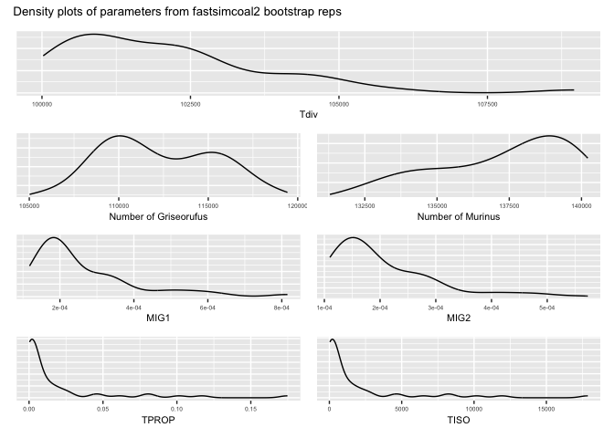

Fastsimcoal_bootstrapping
================
Hannah Kania
2025-08-25

## Fastsimcoal Bootstrapping in R

The following is run on the TSV file produced by following the steps on
the [SFS_Bootstrap GitHub
repository](https://github.com/hkania/SFS_Bootstrap/tree/main).

Set up your R environment.

``` r
library(tidyverse)
library(patchwork)
```

First, load in the data.

``` r
bootstrap_rep_params <- read_tsv("~/Desktop/Graduate2024_25/Coding/SFS_Bootstrap/bootstrap_params.tsv")
```

Next, build basic density plots. These are based only on 50 values each,
so take with a grain of salt! Each of the 50 values came from the best
liklihood measure out of 100 runs of fastsimcoal.

Then, calculate the confidence intervals for each parameter.

``` r
#Calculate quantiles
quant_ngris <- quantile(bootstrap_rep_params$Ngris, probs = c(0.05, 0.5, 0.95))
quant_nmur <- quantile(bootstrap_rep_params$Nmur, probs = c(0.05, 0.5, 0.95))
quant_nanc <- quantile(bootstrap_rep_params$NANC, probs = c(0.05, 0.5, 0.95))
quant_mig1 <- quantile(bootstrap_rep_params$MIG1, probs = c(0.05, 0.5, 0.95))
quant_mig2 <- quantile(bootstrap_rep_params$MIG2, probs = c(0.05, 0.5, 0.95))
quant_tprop <- quantile(bootstrap_rep_params$TPROP, probs = c(0.05, 0.5, 0.95))
quant_tiso <- quantile(bootstrap_rep_params$Tiso, probs = c(0.05, 0.5, 0.95))
quant_maxestlik <- quantile(bootstrap_rep_params$MaxEstLhood, probs = c(0.05, 0.5, 0.95))
quant_maxobslik <- quantile(bootstrap_rep_params$MaxObsLhood, probs = c(0.05, 0.5, 0.95))
quant_tdiv <- quantile(bootstrap_rep_params$Tdiv, probs = c(0.05, 0.5, 0.95))
```

Print the confidence intervals.

``` r
quant_ngris
```

    ##       5%      50%      95% 
    ## 107235.6 111568.5 117525.1

``` r
quant_nmur
```

    ##       5%      50%      95% 
    ## 132727.8 137752.5 140161.7

``` r
quant_nanc
```

    ##       5%      50%      95% 
    ## 126946.6 135277.0 139385.2

``` r
quant_tdiv
```

    ##       5%      50%      95% 
    ## 100202.7 101835.0 104926.0

``` r
quant_mig1
```

    ##           5%          50%          95% 
    ## 0.0001399429 0.0001993205 0.0005657156

``` r
quant_mig2
```

    ##           5%          50%          95% 
    ## 0.0001185821 0.0001683655 0.0004511894

``` r
quant_tprop
```

    ##          5%         50%         95% 
    ## 0.000559184 0.003135100 0.092208915

``` r
quant_tiso
```

    ##      5%     50%     95% 
    ##   57.30  319.00 9334.45

``` r
quant_maxestlik
```

    ##         5%        50%        95% 
    ## -167567638 -167281651 -166939969

``` r
quant_maxobslik
```

    ##         5%        50%        95% 
    ## -160926077 -160620958 -160350584

Finally, print the density plots!

``` r
tdiv / (ngris + nmur) / (mig1 + mig2) / (Tprop + Tiso) +
  plot_annotation(title = "Density plots of parameters from fastsimcoal2 bootstrap reps") &
  theme(plot.title = element_text(size = 10))
```

<!-- -->
